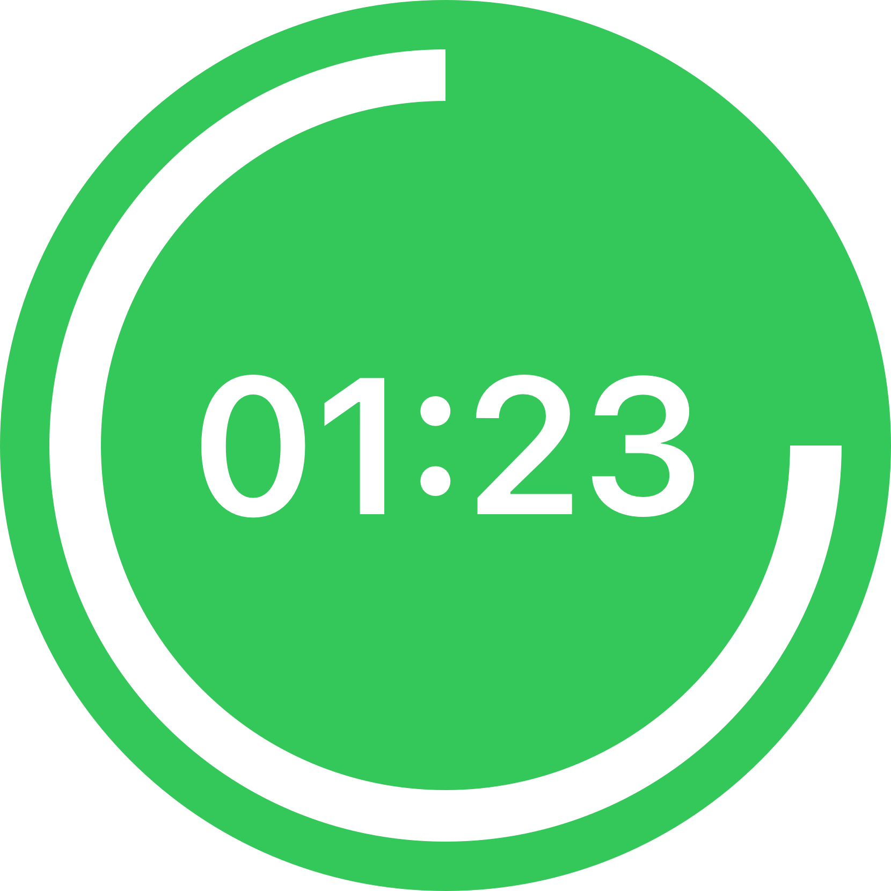

# Privacy Policy

This policy applies to all information collected or submitted via the Interval app on iOS.

## Information We Collect
Inteval does not collect any information. All data is stored on device.

## California Online Privacy Protection Act Compliance
We comply with the California Online Privacy Protection Act. We therefore will not distribute your personal information to outside parties without your consent.

## Children’s Online Privacy Protection Act Compliance
We never collect or maintain information from those we actually know are under 13, and no part of our app is structured to attract anyone under 13.

## Your Consent
By using our app, you consent to our privacy policy.

## Contacting Us
If you have questions regarding this privacy policy, please [email us](mailto:privacy@blta.co?subject=Interval App Privacy Policy).

## Policy Changes
If we decide to change our privacy policy, we will post summary of those changes here:
* **April 16, 2021**: First published
